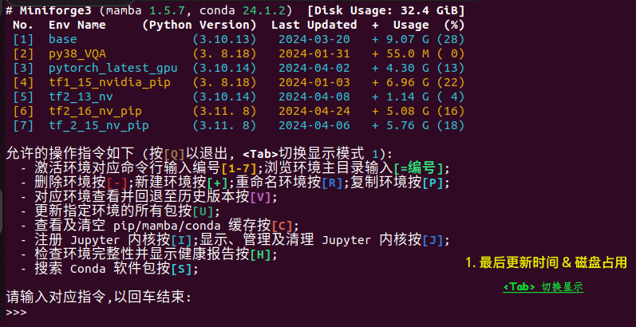
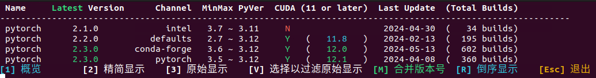
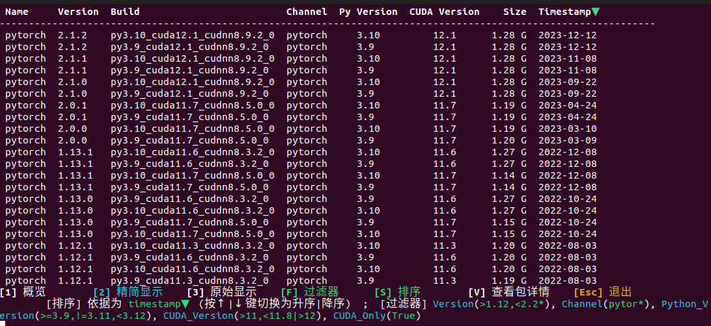
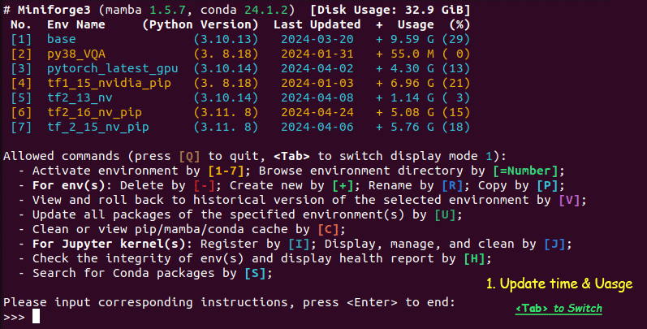
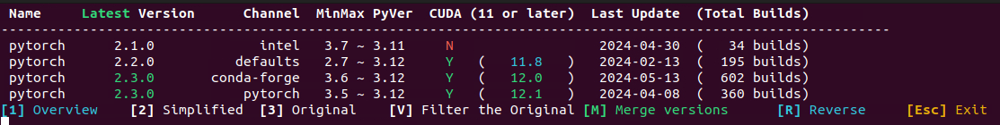
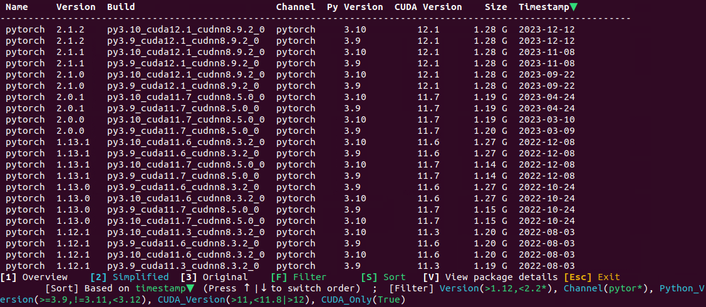

- [中文](#中文)
- [English](#english)

---

## 中文

### Conda 环境管理脚本 (支持Linux和Windows)

（O(∩_∩)O) 这个脚本可以帮助你管理 Conda 环境，让主要操作更加简单易用，而无需记住繁琐的命令行。它支持以下操作：

#### 管理 Conda 环境

| 操作                                      | 按键          | 描述                                                                                                                                                                                                                               |
|-------------------------------------------|---------------|------------------------------------------------------------------------------------------------------------------------------------------------------------------------------------------------------------------------------------|
| 新建环境                                  | [+] 或 [=]           | 快速创建一个新的环境(支持conda包模版)                                                                                                                                                                                                             |
| 删除环境                                  | [-]           | 轻松删除选定的环境及Jupyter注册                                                                                                                                                                                                               |
| 重命名环境                                | [R]           | 对选定的环境进行重命名(能转移Jupyter注册与创建的开始菜单项)                                                                                                                                                                                   |
| 复制环境                                  | [P]           | 简便复制选定的环境                                                                                                                                                                                                               |
| 管理环境的历史版本                    | [V]           | 查看，或回退到选定环境的历史版本(能自动添加所需要的conda包源以正确回溯)                                                                                                                                                                  |
| 更新环境的 Conda 包                      | [U]           | 更新选定环境中的所有Conda包(能自动添加相应Channel源，并严格源顺序以正确更新包版本；支持固定Conda包版本；支持提示Pip包)                                                                                                                                                       |
| 查看及清空缓存             | [C]           | 查看并清空Conda/Pip缓存                                                                                                                                                                                                |
| 检查环境完整性                            | [H]           | 使用`conda doctor`与`pip check`检查环境完整性，并显示健康情况报告                                                                                                                                                                                                             |

#### 管理 Jupyter 内核

| 操作                                      | 按键          | 描述                                                                                                                                                                                                                               |
|-------------------------------------------|---------------|------------------------------------------------------------------------------------------------------------------------------------------------------------------------------------------------------------------------------------|
| 注册 Jupyter 内核                       | [I]           | 将选定环境的Jupyter内核注册到当前用户，以供Jupyter Notebook使用                                                                                                                                                                                          |
| 管理 Jupyter 内核                     | [J]           | 显示、管理所有已注册的Jupyter环境，以及清理已弃用或失效的Jupyter内核                                                                                                                                                                            |

#### 其他

| 操作                                      | [按下] 或 <输入>   | 描述                                                                                                                                                                                                                               |
|-------------------------------------------|---------------|------------------------------------------------------------------------------------------------------------------------------------------------------------------------------------------------------------------------------------|
| 激活环境命令行                                  | [序号] 或 <序号>       | 在**当前工作目录**(由`-d`参数指定)下激活对应的Conda环境的命令行，以进行命令操作                                                                                                                                                                              |
| 浏览环境主目录                            | <@序号>      | 打开文件资源管理器浏览指定环境的主目录                                                                                                                                                                                       |
| (*特色*) 搜索 Conda 软件包           | [S]           | 搜索指定Python版本下的软件包，迅速找到你想要的包。功能强大，界面简洁，简单易用。 - **概览模式** 轻松速览信息汇总(Python最大最小版本，cuda最大支持)， - **精简/详细模式** (版本、Channel、Python版本、cuda版本、包大小、时间戳等信息)，准确定位想要的包； 1. 在受支持的基环境(mamba 或 conda >=23.10)下调用`repoquery search`，加快查询速度； 2. 支持版本比较式过滤，查找更加灵活； 3. 支持显示内容匹配终端宽度。  |

### 界面展示

**主界面 (3种展示模式)**

**搜索 Conda 包界面**

展开/折叠

**搜索-概览**

**搜索-精简显示**

### 开始使用

- #### 方法一 使用源码文件

   1. 有 Python >= **3.10** 的安装；

      在此 Python 环境下安装依赖：

      `python scripts/install_requirements.py`

   2. 已安装了anaconda3，miniforge3，miniconda3等 conda/mamba 包管理环境；

   3. 下载 **conda_env_manager.py**, **MyTools.py**, **ColorStr.py** 3个文件于同一目录下，运行：

      `python conda_env_manager.py`

      3.1 命令行使用提示：

      *加`-h`参数以显示帮助；`-d`参数指定脚本的工作目录；`-p`参数指明其Conda/Mamba发行版安装位置(环境主目录安装在了非常规位置的情况)*

- #### 方法二 使用Release页面的二进制程序

---

## English

### Conda Envs Management Script (Supports Linux and Windows)

(O(∩_∩)O) This script helps you manage Conda environments, making the main operations easier to use without needing to remember complex command lines. It supports the following operations:

#### Managing Conda Environments

| Operation                                  | Key          | Description                                                                                                                                                                                                                           |
|--------------------------------------------|--------------|--------------------------------------------------------------------------------------------------------------------------------------------------------------------------------------------------------------------------------------|
| Create Environment                         | [+] or [=]       | Quickly create a new environment (supports conda package templates)                                                                                                                                                                   |
| Delete Environment                         | [-]          | Easily delete the selected environment and its Jupyter registration                                                                                                                                                                  |
| Rename Environment                         | [R]          | Rename the selected environment (can transfer Jupyter registration and start menu items created)                                                                                                                                      |
| Duplicate Environment                      | [P]          | Easily duplicate the selected environment                                                                                                                                                                                            |
| Manage Environment History                 | [V]          | View or roll back to a selected environment's previous versions (can automatically add required conda sources for correct rollback)                                                                                                   |
| Update Conda Packages in Environment       | [U]          | Update all Conda packages in the selected environment, automatically adding appropriate channel sources in strict order, supporting fixed Conda package versions, and providing prompts for Pip packages                                                                  |
| View and Clear Cache                       | [C]          | View and clear Conda/Pip cache                                                                                                                                                                                                 |
| Check Environment Integrity                | [H]          | Use `conda doctor` and `pip check` to verify environment integrity and display a health status report                                                                                                                                                                   |

#### Managing Jupyter Kernels

| Operation                                  | Key          | Description                                                                                                                                                                                                                           |
|--------------------------------------------|--------------|--------------------------------------------------------------------------------------------------------------------------------------------------------------------------------------------------------------------------------------|
| Register Jupyter Kernel                    | [I]          | Register the Jupyter kernel of the selected environment to the current user for use in Jupyter Notebook                                                                                                                              |
| Manage Jupyter Kernels                     | [J]          | Display and manage all registered Jupyter environments, and clean up deprecated or invalid Jupyter kernels                                                                                                                            |

#### Others

| Operation                     | [Press] or \<Enter>       | Description                                                                                                                                                                                                                           |
|--------------------------------------------|--------------|--------------------------------------------------------------------------------------------------------------------------------------------------------------------------------------------------------------------------------------|
| Activate Environment Command Line          | [Number] or \<Number> | Activate the corresponding Conda environment in the **current working directory** (specified by the `-d` parameter) to perform command operations                                                                                                                                     |
| Browse Environment Home Directory          | <@Number>    | Open the file explorer to browse the home directory of the specified environment                                                                                                                                                      |
| (***Feature***) Search Conda Packages            | [S]          | Search for packages for a specific Python version, quickly find the package you want. Powerful, simple interface, easy to use. - **Overview Mode**: Quickly summarize information (maximum and minimum Python versions, maximum CUDA support), - **Concise/Detailed Mode**: (version, channel, Python version, CUDA version, package size, timestamp, etc.) accurately locate the desired package; 1. Use `repoquery search` in supported base env (mamba or conda >=23.10) to speed up the query; 2. supports version comparison filtering for more flexible searching; 3. Support content display matching terminal width. |

### Interface Display

**Main Interface (3 Display Modes)**

**Search Conda Packages Interface**

Expand/Collapse

**Search - Overview**

**Search - Simplified Display**

### Getting Started

- #### Method 1: Using the Source Code Files

   1. Python >= **3.10** installation is required.

      Install dependencies in this Python environment by run:

      `python scripts/install_requirements.py`

   2. Anaconda3, miniforge3, miniconda3, or any conda/mamba package management environment must be installed.

   3. Download the files **conda_env_manager.py**, **MyTools.py**, **ColorStr.py** and **english_translator.py**, placing them in the same directory.

      Run `python scripts/english_translator.py` now to translate the script to English.

   4. If translated successfully, then run:

      `python conda_env_manager.py`

      4.1 Command-line Usage Tips:

         *Add the `-h` parameter to display help; use the `-d` parameter to specify the working directory of the script; and use the `-p` parameter to specify the installation location of its Conda/Mamba distribution (in cases where the environment's main directory is installed in an unconventional location).*

- #### Method 2: Use the binary program from the Release page

## 致谢 Acknowledgements

感谢 OpenAI ChatGPT 与 Github Copilot 在代码编写、英文翻译上提供的帮助。

Special thanks to OpenAI ChatGPT and GitHub Copilot for their assistance with code writing and English translation.

---

**Would you like to give it a try? 😊 Wishing you a pleasant experience!**
