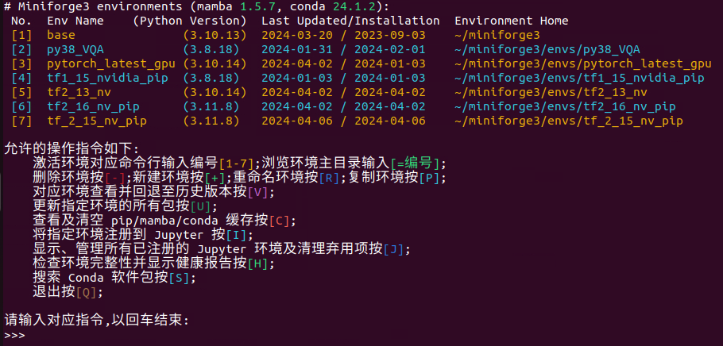
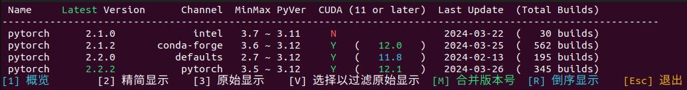
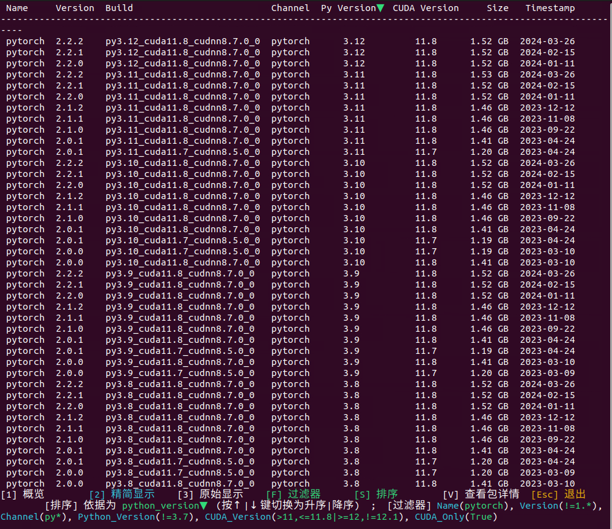
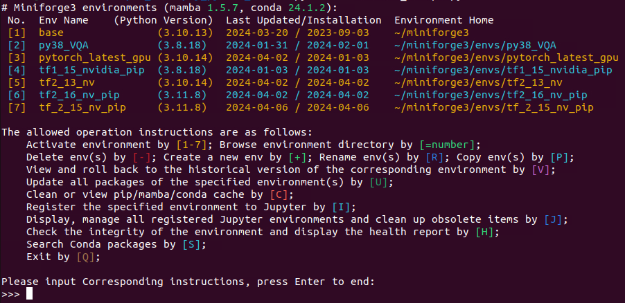
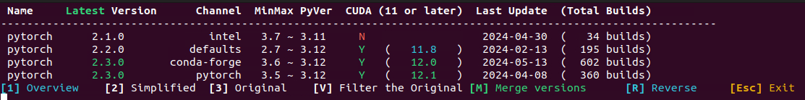
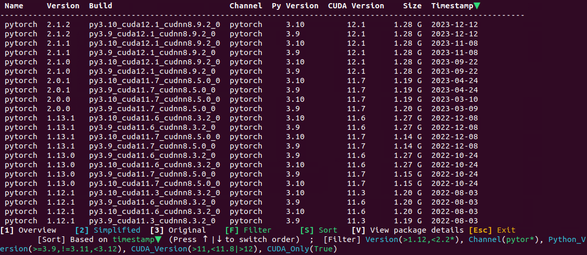

- [中文](#中文)
- [English](#english)

---

## 中文

### Miniforge3 环境管理脚本 (支持Linux和Windows)
（用ChatGPT自动生成的，O(∩_∩)O哈哈~  
这个脚本可以帮助你管理 Miniforge3 环境，让主要操作更加简单易用，而无需记住繁琐的命令行。它支持以下操作：

**激活环境**: 输入对应的编号[1-n]，即可激活指定环境的命令行，进行命令操作。  
**浏览环境主目录**: 输入[=编号]，可以打开文件资源管理器浏览指定环境的主目录。  
**删除环境**: 输入[-]，轻松删除选定的环境。  
**新建环境**: 输入[+]，快速创建一个新的环境。  
**重命名环境**: 输入[R]，可以对选定的环境进行重命名(能转移jupyter注册)。  
**复制环境**: 输入[P]，简便复制选定的环境。  
**查看并回退环境历史版本**: 输入[V]，可以查看并回退到选定环境的历史版本(能自动添加相应源以正确回溯)。  
**更新指定环境的所有包**: 输入[U]，即可更新选定环境中的所有软件包(能自动添加源,并严格源顺序以正确更新包版本)。  
**查看及清空pip/mamba/conda缓存**: 输入[C]，可以查看并清空 pip/mamba/conda 缓存。  
**将环境注册到Jupyter**: 输入[I]，即可将选定的环境注册到当前用户的 Jupyter。  
**显示、管理Jupyter环境**: 输入[J]，可以显示、管理所有已注册的 Jupyter 环境，包括清理弃用项。   
**检查环境完整性**: 输入[H]，显示环境健康情况报告。  
**(特色)搜索指定Python版本下的包**: 输入[S]，可以搜索指定 Python 版本下的软件包，迅速找到你想要的包。功能强大，界面简洁，简单易用，概览模式轻松总览信息汇总(Python最大最小版本，cuda最大支持)，详细显示模式(版本、Channel、Python版本、cuda版本、包大小、时间戳等信息)准确定位想要的包；底层调用`mamba repoquery search`(或conda >=23.9也支持)，查询速度快；支持版本比较式过滤，查找更加灵活。  

### 界面展示

**主界面**

**搜索-概览**

**搜索-详细显示**

### 开始使用
1. 有Python>=3.8的用户级安装；    
   在此Python环境下安装依赖：  
   1.1 win运行 `pip install --user -r requirements-win.txt`   
   1.2 linux运行 `pip install --user -r requirements-linux.txt`   
2. 已安装了anaconda，Miniforge，miniconda等conda/mamba包管理环境；
3. 下载 manage_conda_envs.py, MyTools.py, ColorStr.py 3个文件于同一目录下，运行：    
   `python manage_conda_envs.py` 即可  
   加`-h`参数以显示帮助；若conda环境主目录安装在了非常规位置，可以用`-p`参数指明其安装位置。

##### PS：你好陌生人，欢迎来到我的第一个公开仓库(#^.^#)
由于最初只是想做一个脚本以供自己使用，所以并没有分模块编程，最终变成3000多行的巨大文件，可能会有些难以维护:)；不过脚本目前已经比较完善了，拿去日常使用应该是没有任何问题的。(*￣︶￣)
想着也写了十多天的脚本，自己一个人用也太无聊了，索性放在网上，独乐乐不如众乐乐。或许很久也没有光顾，不过万一有人需要呢，就不会麻烦自己再做一个啦，直接拿我的用就好。^_^  
&nbsp;&nbsp;&nbsp;&nbsp;&nbsp;&nbsp;&nbsp;&nbsp;写于2024.4.3

---

## English

### Manage-Conda-Envs

**Compatible with both Linux and Windows.**

This script can assist you in managing the Miniforge3 environment, making primary operations simpler and more user-friendly, eliminating the need to remember complex command lines. 

### Available Operations:
**Activate Environment**: Input the corresponding number [1-n] to access the command line interface of the selected environment.  
**Browse Environment Home**: Input [=number] to browse the home directory of a specific environment.  
**Delete Environment**: Use [-] to delete the selected environment.  
**Create New Environment**: Press [+] to create a new environment.  
**Rename Environment**: Input [R] to rename the selected environment.  
**Copy Environment**: Press [P] to duplicate the selected environment.  
**View and Rollback Environment History**: Press [V] to view and rollback to previous versions of a specific environment.  
**Update Packages**: Input [U] to update all packages in the selected environment.  
**View and Clear Package Cache**: Use [C] to view and clear pip/mamba/conda caches.  
**Register Environment with Jupyter**: Press [I] to register the selected environment with Jupyter.  
**Manage Jupyter Environments**: Input [J] to display and manage all registered Jupyter environments, including cleaning up deprecated items.  
**Check environment integrity**: Input [H] to display the health status report of the environment."  
**(Key Feature) Search Packages**: Enter [S] to search for specific Python packages under the specified Python version, quickly finding the package you want. It boasts powerful functionality, a clean interface, and ease of use. The overview mode effortlessly summarizes information such as Python's maximum and minimum versions and CUDA's maximum support. In detailed display mode, it provides precise package information including version, channel, Python version, CUDA version, package size, timestamp, and more, aiding in pinpointing the desired package. It utilizes the underlying `mamba repoquery search`(or conda >=23.9 is also supported) for fast query speeds. Additionally, it supports version comparison filtering, enabling more flexible searches. 

Among them, the package **search** feature "[S]" **stands out**.  

### Interface Display

**Main**

**Search - Overview**

**Search - Simplified Display**

### Getting Started
1. Python >= 3.8 installation at user level is required.
Install dependencies in this Python environment by:    
1.1 For Windows, run `pip install --user -r requirements-win.txt`.    
1.2 For Linux, run `pip install --user -r requirements-linux.txt`.    
2. Anaconda, Miniforge, miniconda, or any conda/mamba package management environment must be installed.
3. Download the files manage_conda_envs.py, MyTools.py, ColorStr.py and english_translator.py, placing them in the same directory.   
Run `python english_translator.py` now to translate the script to English.
4. If translated successfully, then run:    
`python manage_conda_envs.py`.       
(Use the `-h` parameter to display help. If the conda environment's main directory is installed in a non-standard location, you can specify its installation location using the `-p` parameter.)

**Would you like to give it a try? 😊 Wishing you a pleasant experience!**
